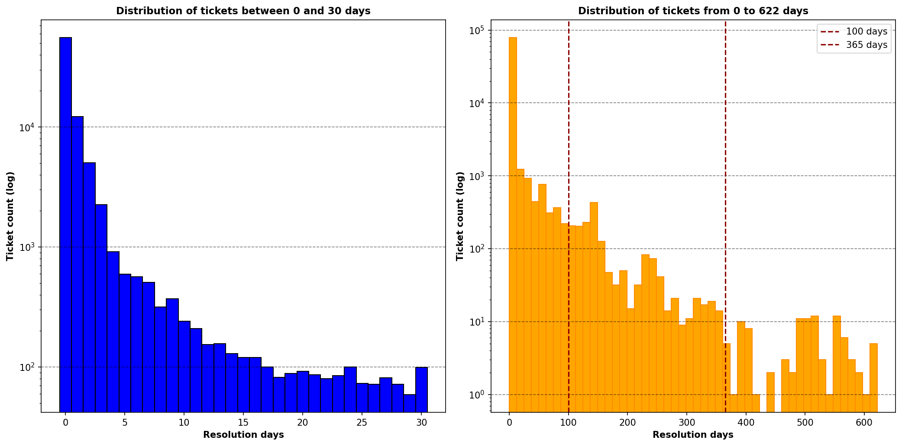
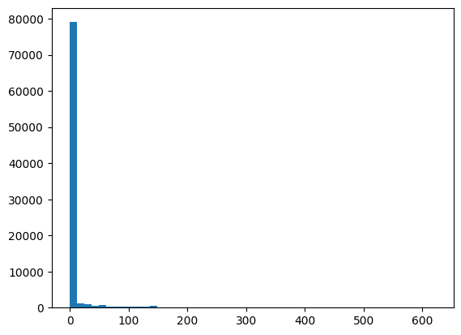
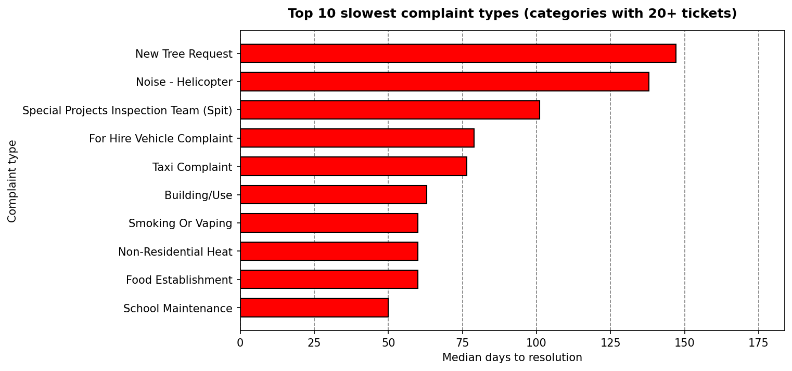
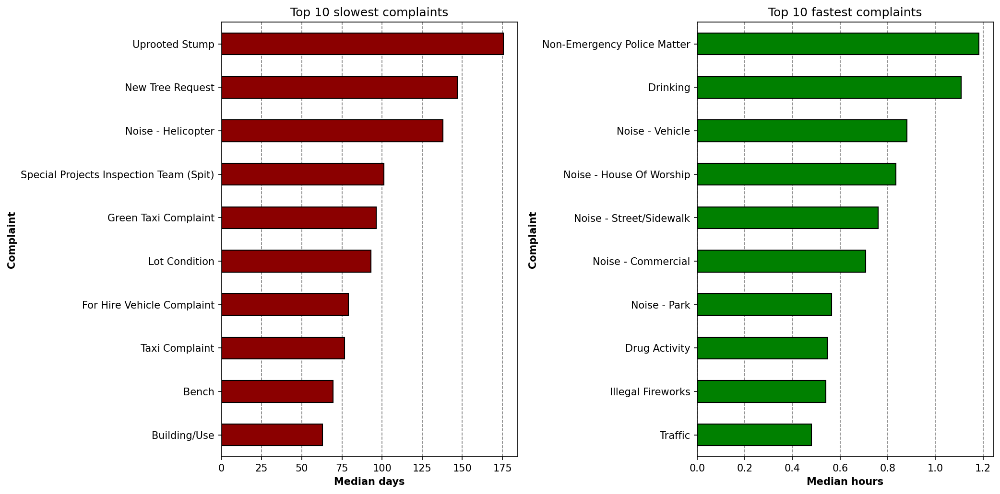
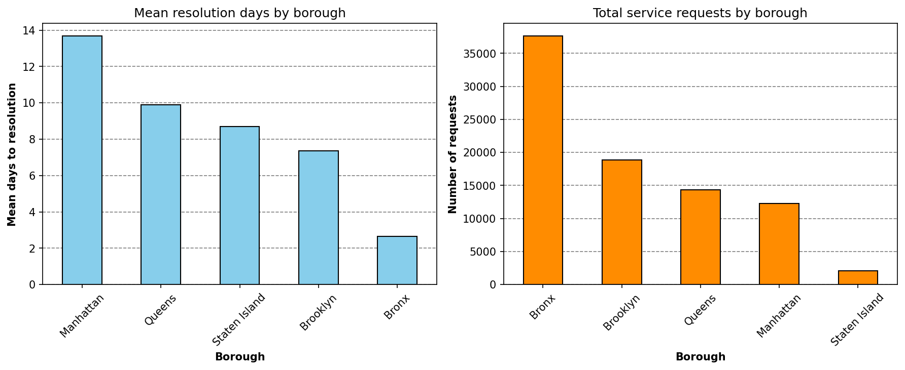
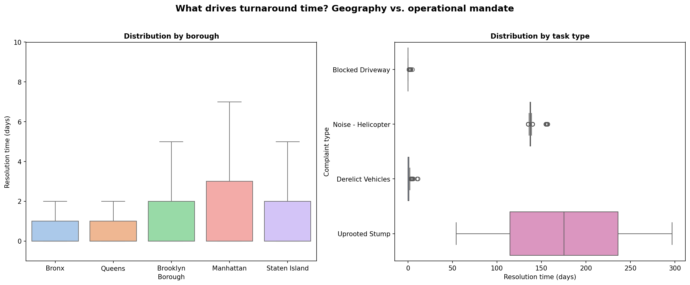

# NYC 311 Resolution Time Analysis

How long does New York City take to close a service request, and what actually decides that?

## The question

311 is where residents report noise, failed heat, potholes, illegal parking and about a hundred other things. Some tickets close the same day they arrive. Some stay open for a year and a half. This project looks at one week of intake and asks four things:

1. Which complaint types take the longest to resolve?
2. Do boroughs differ in how fast they close requests?
3. Does the agency handling a ticket change how long it takes?
4. What is behind the tickets that stay open for months and years?

The short version of what came out: the complaint type explains almost all of the variation, the borough explains almost none of it, and an agency's speed follows the work it is required to do rather than the agency itself.

## Data

Source: [NYC Open Data, 311 Service Requests](https://data.cityofnewyork.us/Social-Services/311-Service-Requests-from-2010-to-Present/erm2-nwe9) (dataset `erm2-nwe9`), pulled through the Socrata API by `src/download_311.py`.

Window: `created_date` between 2025-01-01 00:00:00 and 2025-01-07 23:59:59. Every row was created inside that window, so this is a census of one week of intake rather than a sample of it.

|                | Rows   | Columns |
| -------------- | ------ | ------- |
| Raw download   | 90,565 | 10      |
| After cleaning | 85,122 | 11      |

The raw file lists 149 distinct complaint strings. After the cleaning below there are 133 real categories, spread across 14 agencies and 5 boroughs.

## How the data was cleaned

`notebook/cleaning.ipynb` runs the whole pipeline. Each step is a decision with a reason, and the counts are what the run actually produced.

| Step | Action                                                            | Rows after |
| ---- | ----------------------------------------------------------------- | ---------- |
| 0    | Load the raw download                                             | 90,565     |
| 1    | Keep `status == "Closed"`, export the rest to `Dropped_data.csv`  | 90,103     |
| 2    | Parse both date columns, compute `Resolution_Days`                | 90,103     |
| 3    | Drop 2 tickets whose close timestamp precedes creation            | 90,101     |
| 4    | Drop 35 rows with `borough == "Unspecified"`                      | 90,066     |
| 5    | Drop 465 rows with a missing `incident_zip`                       | 89,601     |
| 6    | Deduplicate on created date, closed date, agency, borough and zip | 85,122     |

Step 1 removes 462 rows: 193 In Progress, 121 Open, 62 Assigned, 37 Pending, 29 Unspecified and 20 Started. A resolution time needs a closed date, so nothing outside `Closed` can be scored.

Step 2 needs a note. 230 of the closed tickets had no close timestamp at all. Instead of dropping them we imputed `2025-01-07 23:59:59`, the end of the collection week, and wrote "No closed date, I assumed they were closed at EOW." into their `descriptor` field so the assumption travels with the row. Those 230 durations are upper bounds on the real answer, not measurements.

Step 3 removed two DOT `Sidewalk Condition` tickets in the Bronx. Both were created on the evening of January 1, 2025 and both carry a close timestamp of December 4, 2024, about four weeks before they were filed. Same descriptor, same zip, same close timestamp, which reads as a duplicate pair linked back to an earlier inspection event.

Step 6 is the largest single cut at 4,479 rows, 5.0% of the file. Neighbours report the same incident from the same building, and those tickets end up sharing an agency, a borough, a zip and both timestamps. Keeping the first occurrence of each combination clears the repeats.

The final file is 85,122 rows by 11 columns, every row `Closed`, no missing values in any of the date, agency, complaint, borough or zip fields, and 973 nulls confined to `Descriptor`, which is an optional sub-classification. Duplicate `Unique_Key` count is zero.

## What the resolution times look like



| Statistic          | Days  |
| ------------------ | ----- |
| Minimum            | 0     |
| 25th percentile    | 0     |
| Median             | 0     |
| 75th percentile    | 1     |
| Mean               | 6.65  |
| Standard deviation | 31.13 |
| Maximum            | 622   |

55,687 tickets, 65.4% of the file, closed on the same calendar day they were created. The median sits at 0 for that reason, and the 75th percentile only reaches 1. The mean is dragged out to 6.65 days by a long tail that runs to 622 days, so the mean describes almost no actual ticket here. Everything below is reported as medians and percentiles for that reason, with means shown only where they say something the median hides.

The log scale in both panels is doing real work. The same data on a linear axis puts 79,050 tickets (92.9%) into the first bar of fifty and flattens every remaining bar down onto the baseline where it cannot be seen, which is what `output.png` from the EDA notebook shows.



## Findings

### 1. Complaint type sets the timeline



Restricting to categories with at least 20 tickets, the ten slowest medians run from `School Maintenance` at 50 days up to `New Tree Request` at 147. A looser cut on volume would put `Uprooted Stump` on top at 175.5 days, but that median comes from two tickets and would be a bad thing to build a claim on. `New Tree Request` is the only category in that chart holding fewer than 50 tickets; the rest run from 53 up to 452.

The fast end behaves nothing like the slow end, which is easiest to see with the two side by side.



For the fast panel, tickets where the create and close timestamps are identical are removed first, otherwise the same-day closures would swamp the measurement and every category would read as zero. What is left still clears in under 1.2 hours of median clock time, and the list is almost entirely NYPD quality-of-life enforcement: noise, drinking, drug activity, illegal fireworks. Comparing the two panels, the slowest median and the fastest one are close to four orders of magnitude apart.

The top of the volume distribution is even more concentrated than the top of the latency distribution. `Noise - Residential` alone is 30,224 tickets, 35.5% of everything. Add `Heat/Hot Water` (14,711) and `Illegal Parking` (9,745) and three complaint types account for 64.2% of the week. Ten types reach 76.2%, which leaves the remaining 123 categories sharing under a quarter of the workload.

### 2. Borough does not matter



The two panels look like a story about geography. The Bronx handles the most requests of any borough and closes them fastest on average; Manhattan handles the fourth-most and closes them slowest. Read on its own, the left panel invites an explanation about borough performance.

The median kills that reading. Every one of the five boroughs has a median resolution time of exactly 0.0 days, so the variance across borough medians is 0.00. Across the 133 complaint types, the same statistic comes out at 900.14, a standard deviation of 30 days between category medians. Geography shifts the typical wait by nothing measurable.



The boxplots show where the difference actually lives. Five borough boxes look like five copies of each other. The complaint-type boxes span ranges wider than the entire distance between the highest and lowest borough.

What makes the borough means differ is portfolio mix. A borough logging a higher share of capital and physical-infrastructure work will average slower than one logging mostly noise calls, and that is the whole of the gap between the Bronx and Manhattan. Compare the same issue across boroughs and it closes:

- `Noise - Residential` has a median of 0.0 days and a 90th percentile of 0.0 days in Queens, Brooklyn, Manhattan and Staten Island, and 1.0 day in the Bronx, which carries 25,798 of the 30,224 citywide residential noise tickets (85.4%) without slowing down.
- `Heat/Hot Water` has a median of 1.0 day in the Bronx, Brooklyn, Queens and Staten Island and 2.0 days in Manhattan. Citywide, only 20 heating tickets out of 14,711 ran past 4 days, and 13 of those 20 were in Manhattan.

### 3. Agency speed follows the mandate, not the badge

| Agency | Tickets | Share | Median | Mean   | P90   | Max |
| ------ | ------- | ----- | ------ | ------ | ----- | --- |
| NYPD   | 49,047  | 57.6% | 0.0    | 0.08   | 0.0   | 7   |
| HPD    | 19,787  | 23.2% | 1.0    | 11.23  | 25.0  | 281 |
| DSNY   | 4,674   | 5.5%  | 1.0    | 4.06   | 11.0  | 274 |
| DOT    | 3,472   | 4.1%  | 1.0    | 9.83   | 9.0   | 567 |
| DEP    | 2,766   | 3.2%  | 0.0    | 5.64   | 7.0   | 561 |
| DOB    | 1,558   | 1.8%  | 5.0    | 62.27  | 210.2 | 621 |
| DOHMH  | 1,237   | 1.5%  | 2.0    | 17.92  | 60.0  | 114 |
| DPR    | 898     | 1.1%  | 7.0    | 42.42  | 147.0 | 622 |
| TLC    | 526     | 0.6%  | 73.0   | 64.16  | 124.0 | 314 |
| EDC    | 452     | 0.5%  | 138.0  | 138.70 | 140.0 | 157 |
| DHS    | 355     | 0.4%  | 2.0    | 19.24  | 108.6 | 118 |
| DCWP   | 291     | 0.3%  | 2.0    | 13.63  | 32.0  | 247 |
| DOE    | 53      | 0.1%  | 50.0   | 119.17 | 496.0 | 496 |
| OTI    | 6       | 0.01% | 4.5    | 6.67   | 14.5  | 21  |

Two agencies absorb 80.8% of the week's work. The table sorts every other agency from 73 days down to 4.5, and it would be easy to read that column as a ranking of who is doing their job. The agency portfolios say otherwise.

EDC is the clearest case. Its 452 tickets are all `Noise - Helicopter`, one complaint type, and its distribution is remarkably tight: median 138.0, 90th percentile 140.0, maximum 157. Every helicopter-noise ticket takes roughly four and a half months because the review involves aviation authorities outside the city. The agency is fast at everything it does; the one job it does is slow.

DOE runs the same pattern on 53 tickets, all `School Maintenance`, median 50 days and a maximum of 496. DOHMH shows both patterns inside one agency: `Rodent` and `Indoor Air Quality` close at a median of 0 days with over 90% inside 48 hours, while `Food Establishment`, `Smoking Or Vaping` and `Non-Residential Heat` all report a median, 70th percentile, 90th percentile and maximum of exactly 60.0 days, which is a fixed administrative window rather than a queue.

The strongest evidence that the badge is not the cause sits inside single agencies:

- TLC closes `Lost Property` (120 tickets) at a median of 0 days with a maximum of 3, and takes a median of 79 days on `For Hire Vehicle Complaint` (278 tickets) and 76.5 on `Taxi Complaint` (124 tickets), because those are disciplinary proceedings rather than lookups.
- HPD closes `Heat/Hot Water` (14,711 tickets) at a median of 1.0 day, and `Unsanitary Condition` (1,273 tickets) at a median of 20 days.
- DSNY closes `Dirty Condition` at a median of 0 days and `Graffiti` (324 tickets) at 35, since graffiti removal needs different equipment and property-owner coordination.
- DOB closes `Real Time Enforcement` at a median of 0 days, and `Building/Use` (285 tickets) at 63 with a mean of 121.60.

### 4. The long tail is narrow, and it belongs to three agencies

Cases over 100 days: 1,783 tickets, 2.09% of the file, median 138 days, longest 622. Cases over 365 days: 98 tickets, 0.12%, median 507 days. About one ticket in 870 ran past a year.

| Agency | Tickets over 100 days | Share of the over-100 pool |
| ------ | --------------------- | -------------------------- |
| HPD    | 668                   | 37.46%                     |
| EDC    | 452                   | 25.35%                     |
| DOB    | 317                   | 17.78%                     |
| DPR    | 106                   | 5.95%                      |
| DOT    | 95                    | 5.33%                      |
| TLC    | 76                    | 4.26%                      |
| DHS    | 42                    | 2.36%                      |

Three agencies account for 80.6% of every ticket in the city that ran past 100 days, and between them they cover the mechanisms behind a long wait. HPD contributes raw volume of ordinary maintenance casework that keeps missing landlord re-inspections and tenant access. EDC contributes a single regulatory process. DOB contributes inspection and engineering review.

Past a full year the causes shift again. Of the 98 tickets over 365 days, 27 are DOB's `Special Projects Inspection Team`, 16 are construction and building-use enforcement, 9 are school maintenance, and 8 each are DEP water-system and DOT street-light work. Year-long tickets are structural investigations, underground utility excavation and public procurement, not routine service failures.

## Repository layout

```
├── README.md
├── data/
│   ├── raw/311_jan_week1_2025.csv          90,565 x 10, gitignored
│   └── clean/
│       ├── 311_jan_week1_clean.csv         85,122 x 11, the analysis file
│       ├── Dropped_data.csv                the 462 non-closed rows
│       └── agency/
│           ├── Tickets/*.csv               one file per agency, full tickets
│           └── by_complaints/*.csv         per-agency summary by complaint type
├── figures/                                charts from the visualization notebook
├── notebook/
│   ├── cleaning.ipynb                      raw file to the cleaned file
│   ├── agency_export.ipynb                 writes data/clean/agency/
│   ├── EDA.ipynb                           distributions, percentiles, findings
│   └── visualization.ipynb                 the five charts
├── src/download_311.py                     paged Socrata API download
├── output.png                              linear histogram, EDA notebook
└── subplots_of_tickets_two_range.png       dual-panel log histogram
```

Each file in `data/clean/agency/by_complaints/` carries ticket count, median, mean, 75th percentile, 90th percentile, maximum, the category's share of that agency and its cumulative share, so an agency's portfolio can be read without opening a notebook.

## Running it again

```bash
python src/download_311.py      # writes data/raw/311_jan_week1_2025.csv
```

Then run the notebooks in order: `cleaning`, `agency_export`, `EDA`, `visualization`.

## Tools

Python 3.12 with pandas, numpy, matplotlib, seaborn, requests and Jupyter.
